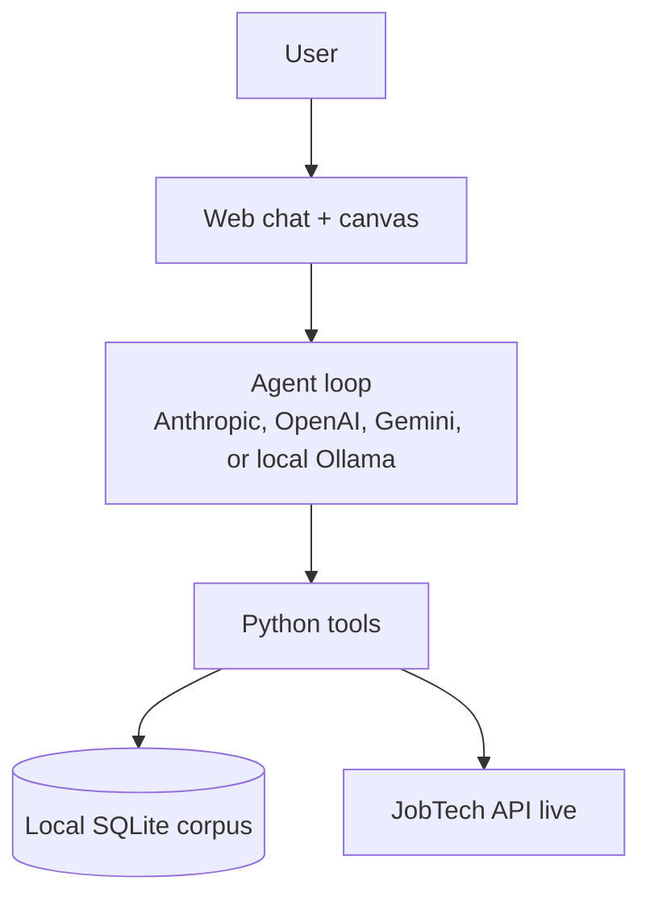
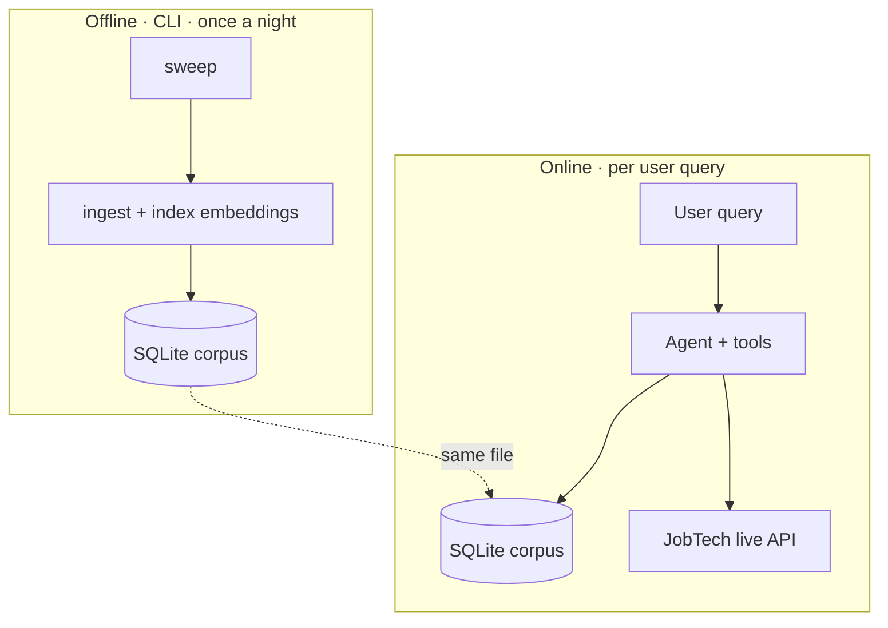
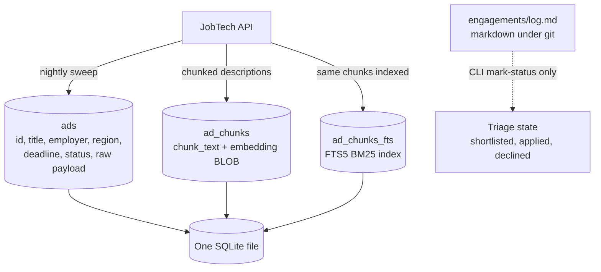
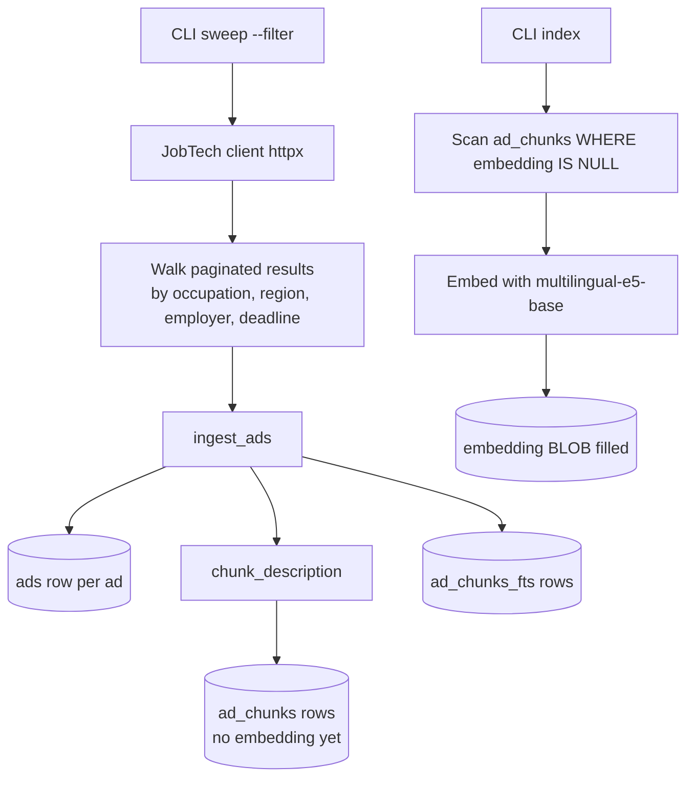
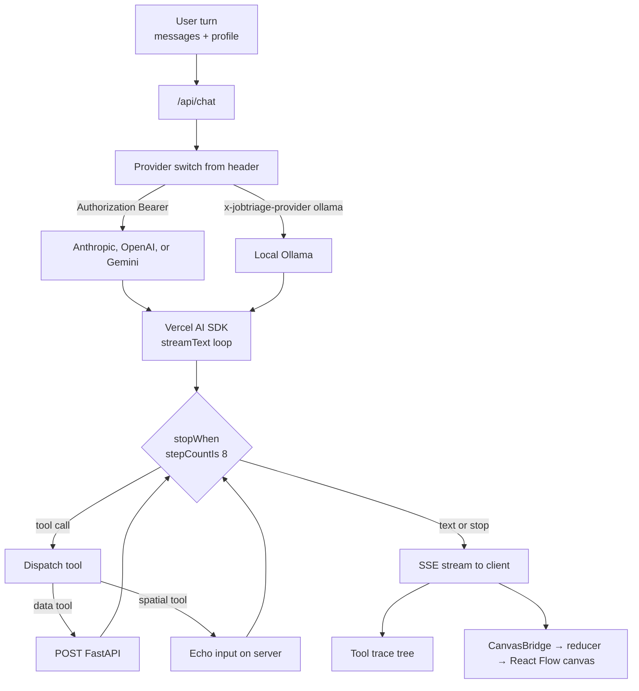
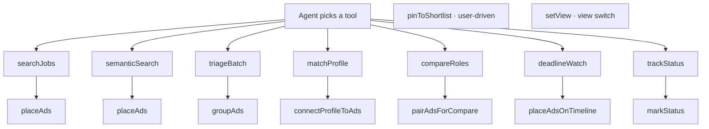
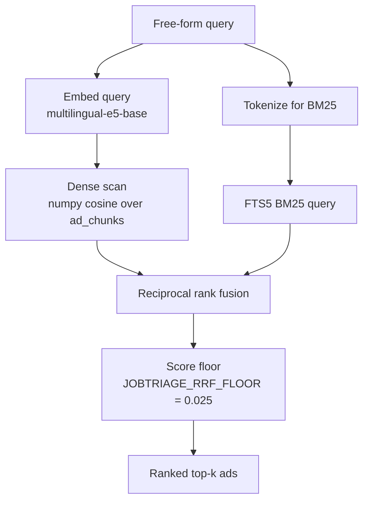
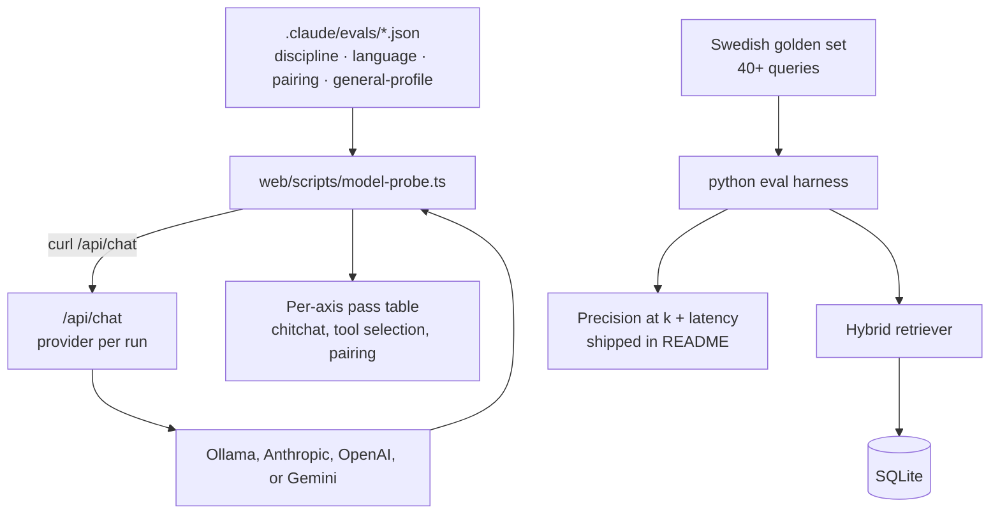

# Diagrams

Read top to bottom. The order is chronological. The system gets framed first, then the corpus comes to life, then a query travels through it, then we measure how well it worked.

Authored per `standards/diagrams.md`. Vertical layout, short labels, prose under each diagram.

## 1. The whole system in five boxes

A chat UI drives an LLM agent. The agent calls Python tools over HTTP. Tools either read from a local SQLite corpus or hit Sweden's JobTech API live. The right half of the chat surface is a canvas the agent populates with structured ad cards. The deployed demo runs in a slim posture that skips the corpus and goes straight to JobTech live. Local CLI and the local browser dev surface keep the corpus in the loop.

## 2. Two phases share one corpus, on local

Ingestion is the only path that writes to the corpus. It runs nightly, CLI-only. Online query traffic is read-only. The same SQLite file backs both phases on local. The deployed Cloud Run image is slim and omits the corpus, since a maintainer-curated corpus pre-swept against engineering filters returns nothing for a nurse or a marketer. In the deployed posture, the corpus path disappears and the agent leans on the live JobTech branch.

The next three sections follow the offline phase. What storage exists and how it gets populated.

## 3. What the corpus contains

Three tables in one SQLite file: structured ad metadata, chunked description text with dense embeddings, and the FTS5 keyword index over those same chunks. Triage state (what you have shortlisted, applied to, declined) lives in a separate markdown file under git, mutated only by the CLI. The web demo never writes anywhere.

Why a local corpus at all: JobTech's API does not offer arbitrary BM25 or dense vector search, embeddings cannot be computed fresh per query at interactive latency, full description text needs N+1 detail fetches we do not want at query time, and a fixed snapshot is what makes the eval ablation reproducible.

## 4. How the corpus gets populated

Two CLI commands run in order. `sweep` pulls from JobTech with structured filters, splits descriptions into chunks, writes ads plus chunks plus FTS5 rows. `index` backfills embeddings on chunks where the BLOB is still null. The two steps are split because re-embedding does not require re-fetching, and the embedding model only loads when needed. Ingestion is append-mostly: ads no longer in the live result set get marked inactive, never deleted, so yesterday's hits stay queryable.

The corpus is now ready. The remaining sections follow a single online query through the system.

## 5. A query enters the agent loop

The loop runs server-side in a Next.js route handler. The provider is picked per request from headers. BYOK visitors send `Authorization: Bearer <key>` for one of three providers (Anthropic, OpenAI, Gemini). Local Ollama maps via a custom header. The Vercel AI SDK runs at most eight steps per turn, calling tools or emitting text. Data tools post to the FastAPI backend. Spatial tools just echo their input on the server, and the client translates the resulting output parts into canvas mutations. Profile and BYOK key sit in browser sessionStorage, never on the server.

## 6. Which tool the agent picks

Fifteen tools split into two classes. Seven data tools do work: query JobTech, run retrieval, score against the profile, read the engagement log. Eight spatial tools do not call any backend. They exist so the agent can drive the canvas through the same SDK tool-call mechanism the data tools use. The system prompt fixes the pairing. Every data tool fires exactly one spatial tool after it, and profile-fit composition stacks `connectProfileToAds` on top when the user wants ads scored against the saved profile.

The deployed posture swaps `semanticSearch`, `triageBatch`, and `deadlineWatch` out (they need the corpus) and adds `lookupConcept` as a setup gate that resolves user-facing terms like "nursing in Stockholm" to JobTech taxonomy ids before the live `searchJobs` runs.

## 7. Inside the two retrieval tools

When the agent picks `semanticSearch` or `triageBatch`, this is what the backend runs. The query is embedded once, scored two ways (cosine over the dense embeddings, BM25 over the keyword index), and the two ranked lists are fused with reciprocal rank fusion. A score floor suppresses tangential matches on adversarial queries. Other tools do not go through retrieval. `searchJobs` hits JobTech live, `matchProfile` and `compareRoles` work over already-retrieved ads.

## 8. How we measure the system worked

Two harnesses, one per concern. `model-probe.ts` drives the live `/api/chat` route with JSON fixtures and reports per-axis pass rates per provider. Used to regression-check the agent on every PR that touches the prompt or tools. The Python harness runs the Swedish golden query set against the retriever alone, no LLM in the loop, and produces the four-configuration ablation table that ships in the README. Both stacks are documented in `.claude/context/evals.md`.
