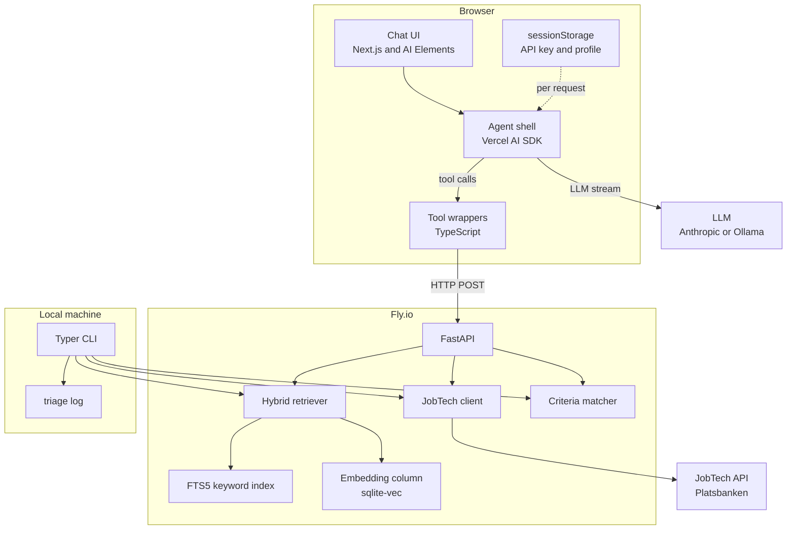
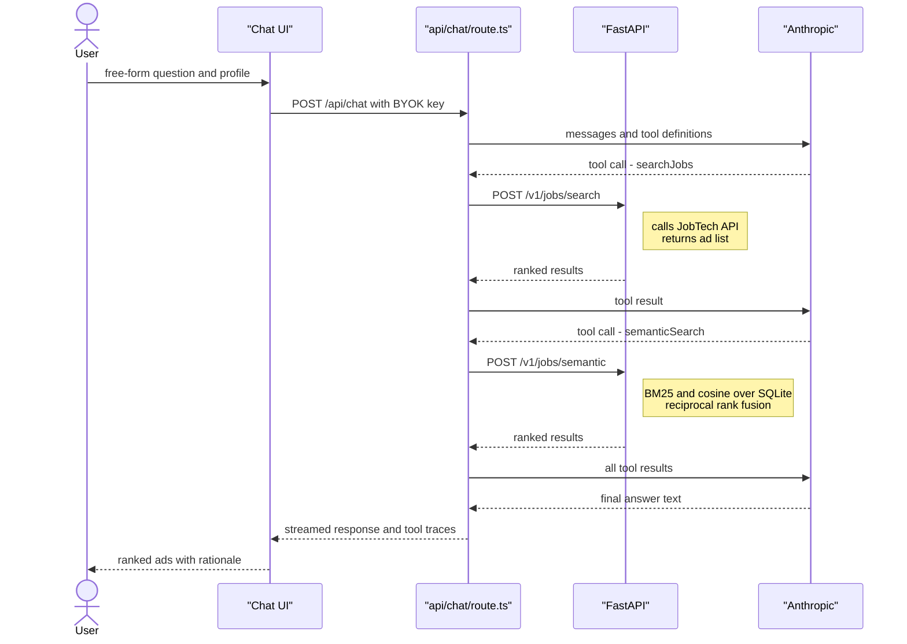
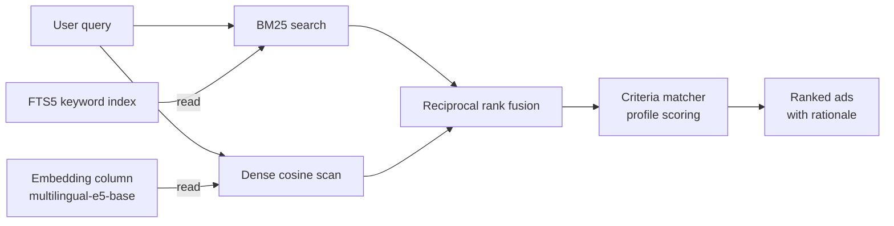
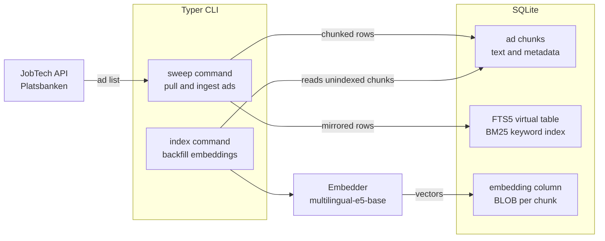
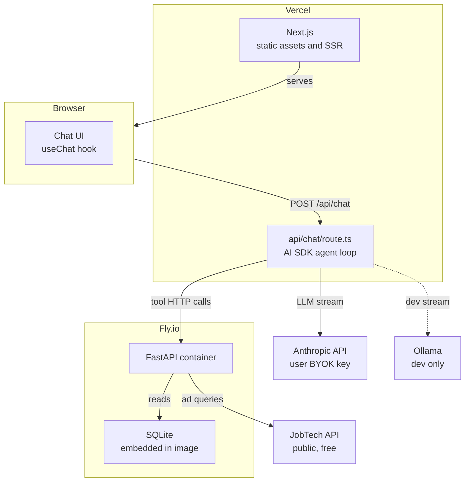

# Diagrams

Source: planning docs (`ARCHITECTURE.md`, `REQUIREMENTS.md`, `docs/python.md`, `docs/web.md`). Five diagrams cover system components, agent request flow, hybrid retrieval pipeline, corpus ingestion pipeline, and deployment topology.

## System components

The five-layer stack from chat UI down to SQLite storage, plus the CLI path that bypasses the HTTP layer and talks directly to Python tools.

## Agent request flow

One full turn: the user sends a question, the Next.js API route runs the agent loop, calls two tools via FastAPI, and streams a ranked answer with tool-call traces back to the browser.

## Hybrid retrieval pipeline

Query-time path through `semanticSearch` and `triageBatch`. Two parallel retrievers merge via reciprocal rank fusion before optional profile scoring.

## Corpus ingestion pipeline

How the SQLite ad corpus is built and kept current. The `sweep` CLI command pulls live ads from JobTech and writes chunks to SQLite. A separate `index` command backfills the embedding column for hybrid retrieval.

## Deployment topology

Web surface on Vercel, backend on Fly.io with SQLite embedded in the container image. The Next.js API route runs the agent loop server-side and forwards tool calls to FastAPI. The BYOK Anthropic key is sent per request and never persisted server-side.

