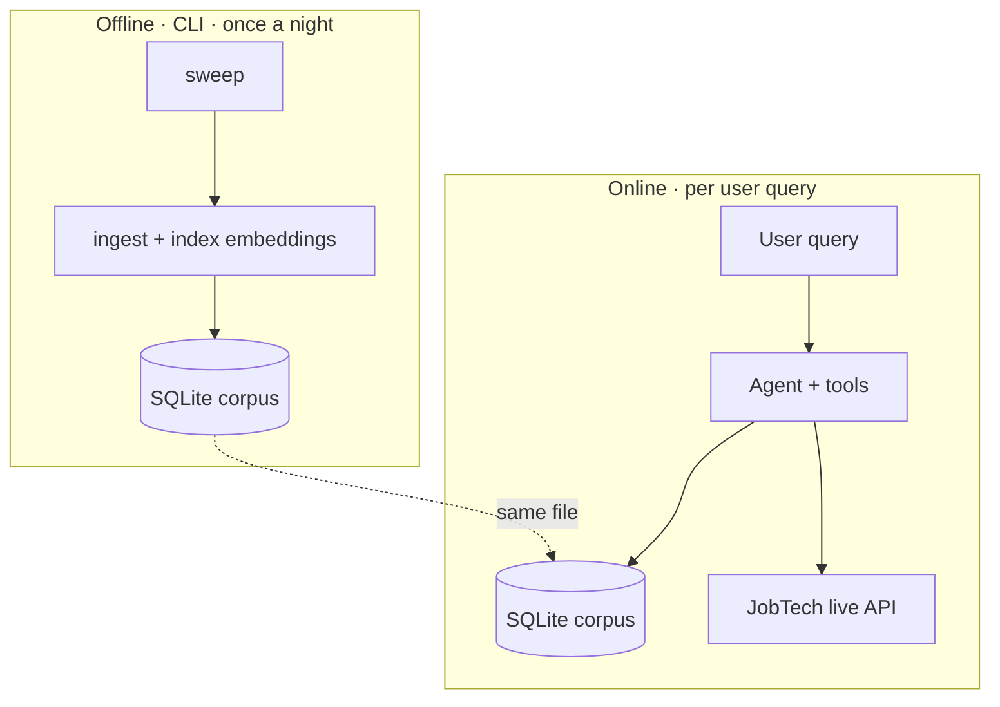

# Components

Ingestion is the only path that writes to the corpus. It runs nightly, CLI-only. Online query traffic is read-only, and the same SQLite file backs both phases on local.

Data tools query JobTech or the corpus directly. Spatial tools never call the backend at all. They echo their input instead, and the client translates that echo into canvas mutations. See `.claude/context/canvas.md` for the spatial-tool bridge.

The deployed Cloud Run image is slim and omits the corpus, since v4.10 gated corpus-dependent tools out of the deploy posture. In that posture the online layer above loses its corpus edge entirely and leans on the live JobTech branch alone.
