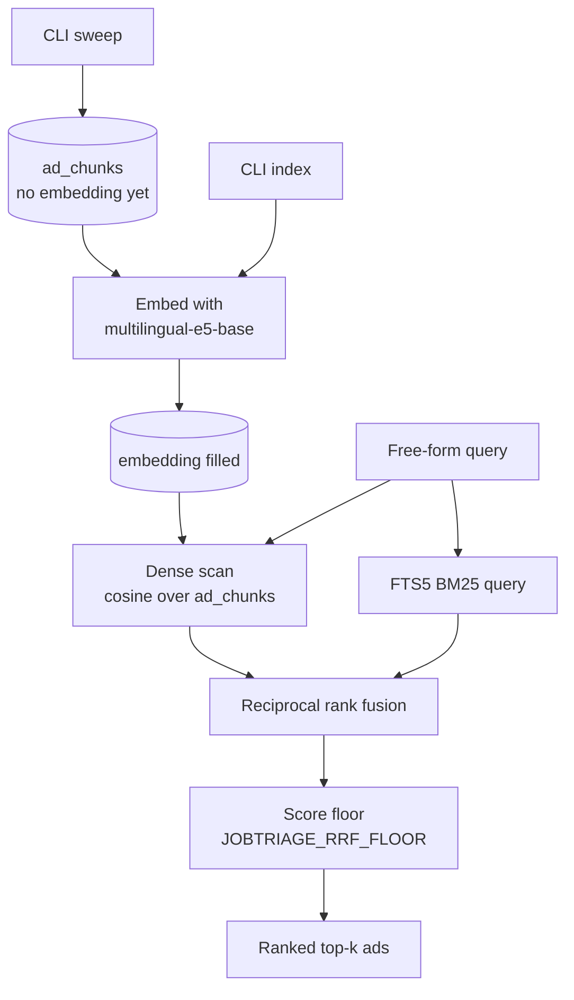
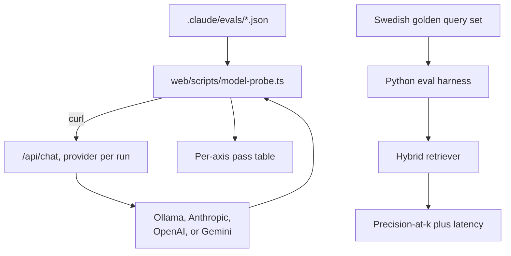

# Data pipeline

Two CLI commands run in order. `sweep` pulls from JobTech with structured filters and writes ads plus chunked description text. `index` backfills embeddings on chunks where the column is still null, so re-embedding never requires re-fetching. Ingestion is append-mostly: an ad no longer in the live result set gets marked inactive, never deleted, so yesterday's hits stay queryable.

When the agent picks `semanticSearch` or `triageBatch`, the backend embeds the query once and scores it two ways: cosine similarity over the dense embeddings and BM25 over the FTS5 keyword index. The two ranked lists are fused with reciprocal rank fusion, then a score floor (`JOBTRIAGE_RRF_FLOOR`, default 0.025) suppresses tangential matches on adversarial queries. `searchJobs` hits JobTech live and skips this pipeline entirely. See `.claude/context/retrieval.md` for the chunking contract and the RRF floor rationale.

## How the two eval harnesses measure the system

Two harnesses, one per concern. `model-probe.ts` drives the live `/api/chat` route with JSON fixtures and reports per-axis pass rates per provider, run on every PR that touches the prompt or the tools.

The Python harness runs the Swedish golden query set against the retriever alone, no LLM in the loop, and produces the four-configuration ablation table that ships in the README. Neither harness calls the other. Both are documented in `.claude/context/evals.md`.
