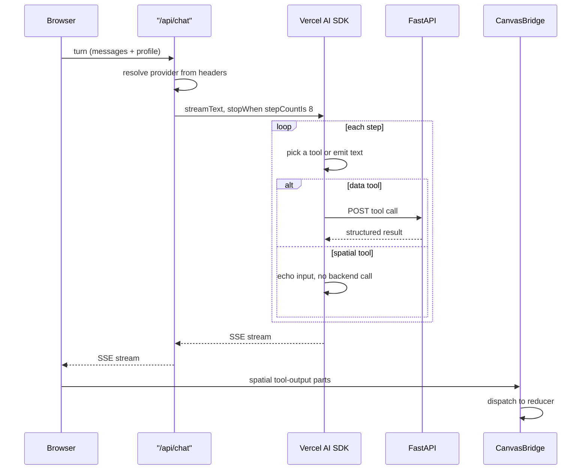

# Request flow

The loop runs server-side in a Next.js route handler. The provider is picked per request from headers: BYOK visitors send `Authorization: Bearer <key>` for Anthropic, OpenAI, or Gemini, and local Ollama maps through a custom header. The Vercel AI SDK runs at most eight steps per turn.

Data tools post to the FastAPI backend and wait on a real result. Spatial tools never leave the server process. They echo their input, and the client's `CanvasBridge` translates the resulting output parts into canvas mutations.

Profile and BYOK key live in browser sessionStorage and never reach the server outside the request body. See `.claude/context/agent.md` for the full tool registry and `.claude/context/canvas.md` for the bridge.
