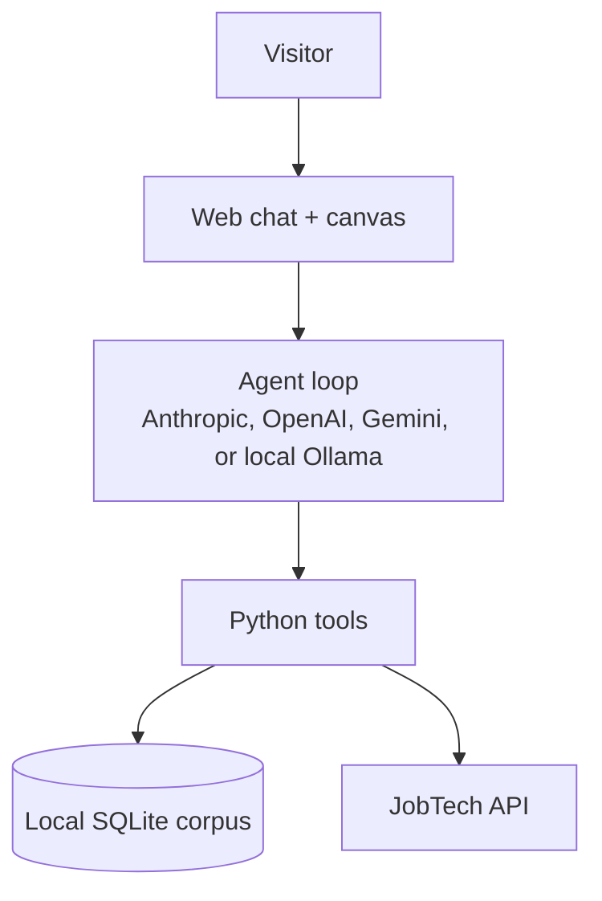

# System context

A visitor drives a chat UI backed by an LLM agent. The agent calls Python tools over HTTP, which either read a local SQLite corpus or hit Sweden's JobTech API live. The right half of the chat surface is a canvas the agent populates with structured ad cards.

The deployed demo runs in a slim posture that skips the corpus and goes straight to JobTech live, since a maintainer-curated corpus pre-swept against one profession returns nothing for a visitor in another. The local CLI and the local browser dev surface keep the corpus in the loop. See `.claude/context/agent.md` for the provider switch and deploy-vs-local posture.
