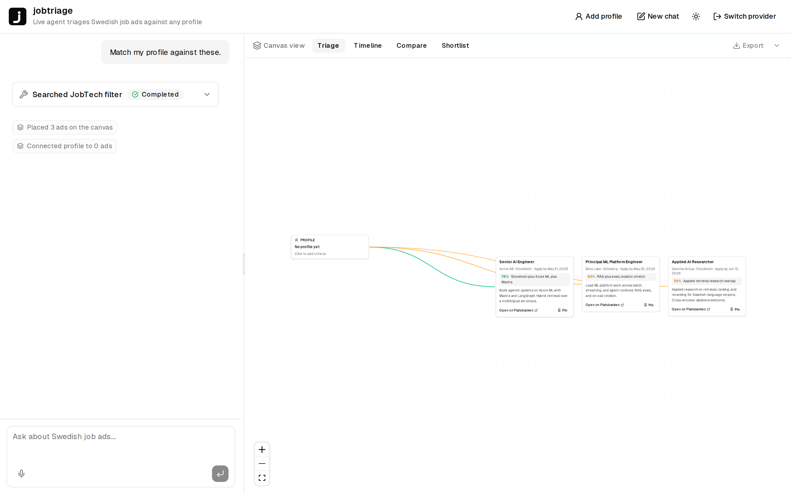

<p align="center">
  
</p>

<h1 align="center">jobtriage</h1>

<p align="center"><a href="https://github.com/erclx/jobtriage/actions/workflows/verify.yml?query=branch%3Amain"></a></p>

<p align="center">Job board search ranks for the platform, not for you. jobtriage triages Swedish job ads against a profile you paste, lays the results onto a spatial canvas you can compare and shortlist on, and shows the agent's tool calls inline so the ranking stays auditable.</p>

<p align="center"><a href="https://jobtriage.erclx.dev"><b>Try it at jobtriage.erclx.dev</b></a> · <a href="https://youtu.be/puAueu9ed3o">Video walkthrough</a></p>

<picture>
  <source media="(prefers-color-scheme: dark)" srcset="web/evidence/readme/dark.png">
  
</picture>

The demo path replays a scripted session captured against live JobTech ads, so it walks through real cards without needing a provider key. Bring an Anthropic, OpenAI, or Gemini key to drive the agent yourself.

## Features

- Works for any profession. The deployed demo resolves "nursing in Stockholm" or "chef in Malmö" to JobTech taxonomy concepts on the fly, then runs the agent against live Platsbanken results.
- Spatial workspace. Retrieved ads land as draggable nodes on a React Flow canvas with four canonical views: triage clusters, deadline timeline, side-by-side compare, and a pinned shortlist that exports to markdown or CSV.
- Scripted demo replay. The gate exposes a "Try the demo" button that replays a recorded session of real JobTech ads. Tool traces, cards, and the spatial canvas render identically to a live agent run, no key required.
- Bring-your-own-key. The deployed demo holds nothing server-side. The gate accepts an Anthropic, OpenAI, or Gemini key, held in browser sessionStorage only. Local dev adds an Ollama path for a fully offline run.

## Quickstart

Requires [Bun](https://bun.sh) and [uv](https://docs.astral.sh/uv/).

```bash
bun install
cd web && bun install
cd ../python && uv sync
```

Start the FastAPI backend on `http://127.0.0.1:8000` and the web app on `http://localhost:3000`:

```bash
bun run dev:api          # FastAPI tool server
bun run restart:web      # Next.js production build, see docs/development.md
```

## How it works

The chat surface runs in the browser on the Vercel AI SDK. Each user turn fires the agent loop on a thin Next.js route handler that forwards the user-supplied API key as a Bearer token. Provider selection is per-request: the BYOK gate persists the choice in browser sessionStorage and sends it back as a header so the route can swap between Anthropic, OpenAI, Gemini, and local Ollama providers without a code edit.

Two postures share the same agent shell. The deployed demo runs `lookupConcept` against the JobTech taxonomy, then `searchJobs` against the live JobSearch API, then reasons in-context with `matchProfile` and `compareRoles` over the returned ads. The local CLI and the local browser dev surface keep the corpus-dependent stack: hybrid retrieval (BM25 plus dense over `multilingual-e5-base`) fused with reciprocal rank fusion, plus deadline filtering and engagement tracking against a local markdown log.

After every data tool the agent fires at least one spatial tool. The system prompt pins the pairings: `searchJobs` to `placeAds`, `triageBatch` to `groupAds`, `matchProfile` to `connectProfileToAds`, `compareRoles` to `pairAdsForCompare`, `deadlineWatch` to `placeAdsOnTimeline`, `trackStatus` to `markStatus`. The canvas is the answer, not a decoration of the chat transcript. Chat, canvas, and pinned shortlist all hydrate from sessionStorage on refresh so a recruiter pasting a profile mid-session never loses state.

Voice input ships in Chrome via the Web Speech API. The mic affordance hides cleanly in Firefox and Safari rather than breaking. Below 1024px the canvas hides and the chat rail surfaces a "Best viewed on a desktop" notice, since the spatial workspace is the load-bearing artifact.

## Hybrid retrieval ablation

Hybrid retrieval (BM25 plus dense embeddings fused via reciprocal rank fusion) powers the Typer CLI and the local dev surface. The deployed demo calls JobTech live instead, so it can answer for any profession rather than a maintainer-curated corpus.

On a 50-query Swedish golden set, hybrid retrieval reaches 0.950 recall@10 against 0.150 for a plain JobTech filter. Dense embeddings alone edge out hybrid on precision@1, and hybrid earns its place back on adversarial queries where exact keyword matches dominate. Full numbers, the corpus, and the reproduction command are in [Evaluation](docs/evaluation.md).

## Agent eval

The agent loop is measured per provider against a ten-probe fixture spanning multi-tool chains, adversarial queries, and citation discipline. Anthropic currently passes 5 of 10 with 92% tool-call accuracy. OpenAI and Gemini rows are pending a rate-limit fix in the eval harness. Full table and reproduction command in [Evaluation](docs/evaluation.md).

## Multilingual embedding comparison

Swapping the encoder on the same golden set: an English-only baseline loses 11 points of recall@10 on Swedish queries against the multilingual encoder this project ships with, and a larger multilingual encoder buys another 8 points of precision@1 for roughly 70% more memory and latency. Full table in [Evaluation](docs/evaluation.md).

## Differentiation against prior art

Other public projects in adjacent space and the gap jobtriage fills:

- [santifer/career-ops](https://github.com/santifer/career-ops): a workflow framework built on Claude Code skills with a Go dashboard and PDF generation. Self-hosted, runs in your own Claude Code session. jobtriage is a hosted public demo with a spatial canvas, pinned to one national job board (JobTech / Platsbanken) where a recruiter can paste a profile and triage in a browser tab.
- [kyosek/RAG-based-job-search-assistant](https://github.com/kyosek/RAG-based-job-search-assistant): a RAG demo over a scraped LinkedIn snapshot. Static, English, no live ad freshness. jobtriage runs against live JobTech in deploy and runs hybrid retrieval over a Swedish-language corpus in the repo and CLI path, with the embedding ablation above to back the multilingual claim.
- [Jobtechdev-content/Jobsearch-content](https://github.com/Jobtechdev-content/Jobsearch-content) and similar JobTech API wrappers: SDK and content-level integrations. jobtriage layers an agent loop, profile-aware ranking, hybrid retrieval, and a spatial workspace on top of the same upstream API.

## Build approach

Built with Claude Code as the primary agent. The planning docs, coding standards, and full agent config are reproducible from [CLAUDE.md](CLAUDE.md).

## Documentation

- [Development](docs/development.md) covers setup and running the app locally.
- [Deploy](docs/deploy.md) covers taking your own fork to Cloud Run and Vercel.
- [Evaluation](docs/evaluation.md) covers the retrieval, agent, and multilingual numbers, with reproduction commands.

## License

MIT, see [LICENSE](LICENSE).
